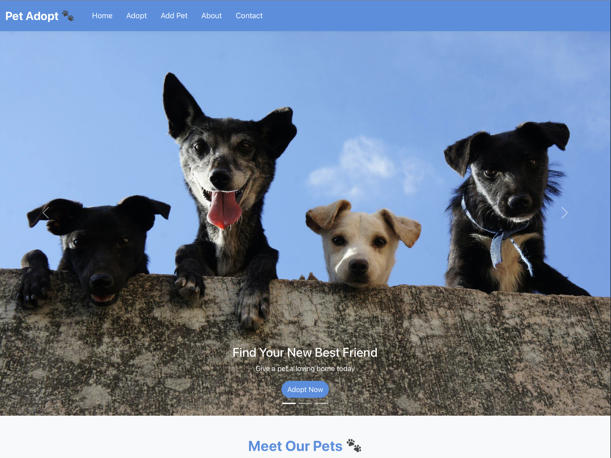
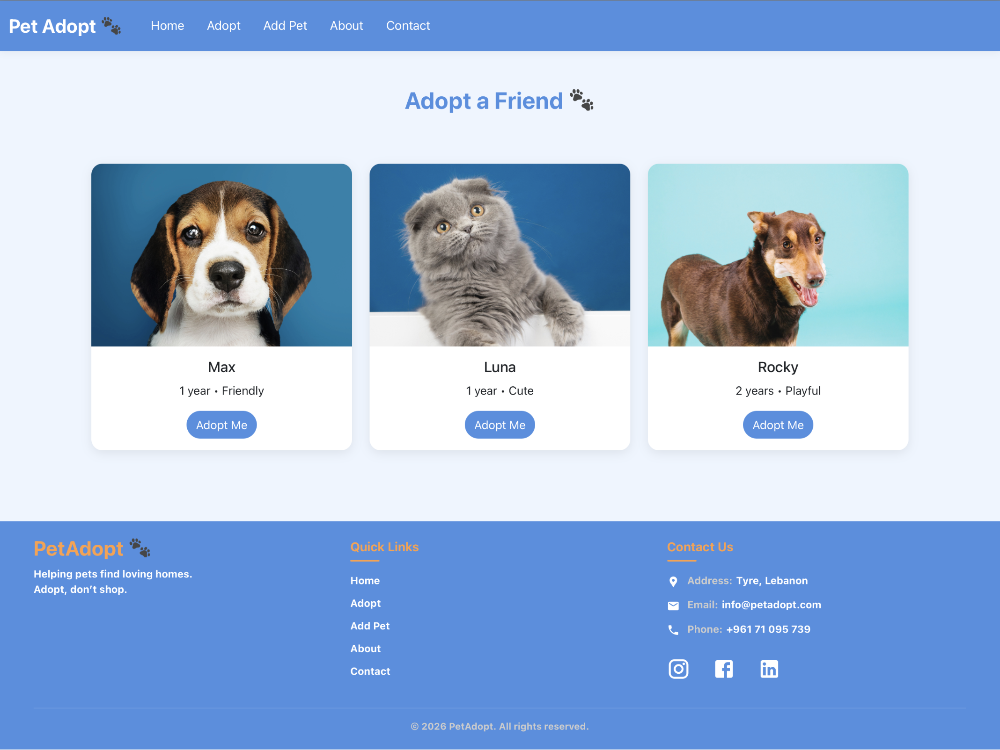
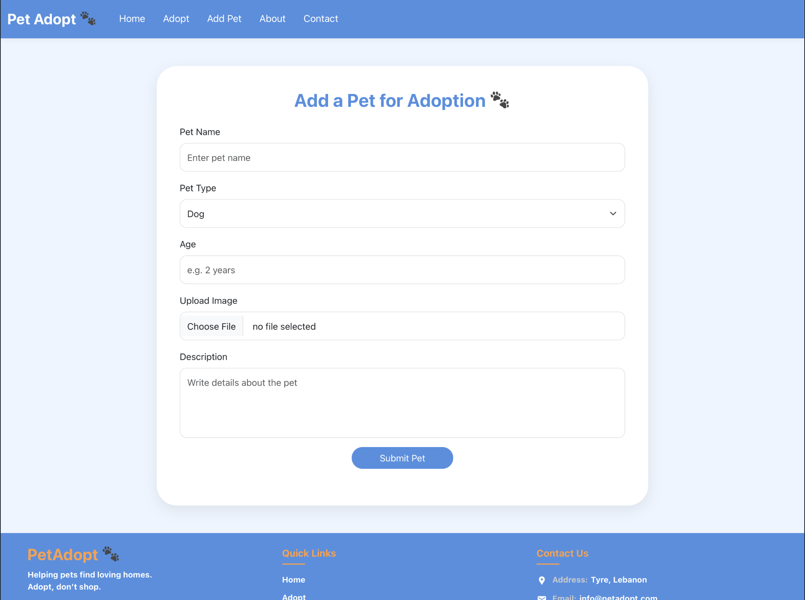
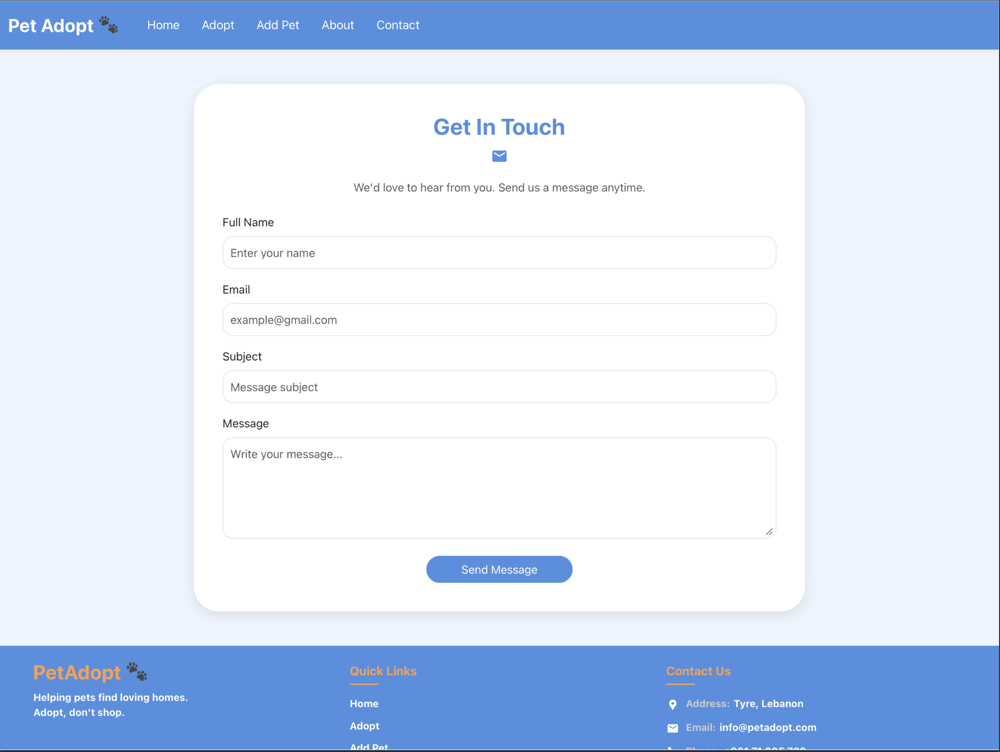

# Pet Adoption Website

## Project Description

Pet Adoption Website is a frontend web application developed using ReactJS.  
The main goal of this project is to help users browse pets available for adoption and provide a simple way to submit pet information through an online form.

The website includes multiple pages such as Home, Adopt, Add Pet, About, and Contact.  
It is designed to be responsive and user-friendly, using React components, routing, Bootstrap, and custom CSS.

## Features

- Home page with a pet adoption landing section
- Adopt page to display pets available for adoption
- Add Pet form using React state
- About page describing the website purpose
- Contact page for user communication
- Responsive design for desktop and mobile screens
- Navigation between pages using React Router
- Deployment using Vercel
- Source code managed with Git and GitHub

## Technologies Used

- ReactJS
- JavaScript
- HTML
- CSS
- Bootstrap
- React Router
- Git
- GitHub
- Vercel

## Setup Instructions

To run this project locally:

1. Clone the repository:

```bash
git clone https://github.com/mahdi-ali259/pet-adoption.git
```

2. Open the project folder:

```bash
cd pet-adoption
```

3. Install dependencies:

```bash
npm install
```

4. Start the project:

```bash
npm start
```

5. Open the website in the browser:

```bash
http://localhost:3000 
```

## Live Demo

Vercel Website Link:

[Live Website](https://pet-adoption-6x9g.vercel.app)

## GitHub Repository

[GitHub Repository](https://github.com/mahdi-ali259/pet-adoption) 

## Screenshots

### Home Page



### Adopt Page



### Add Pet Page



### Contact Page



## Author

Mahdi Ali & Malak Watfa

## Course

CSCI390 Web Programming

## Project Phase

Project Phase 2